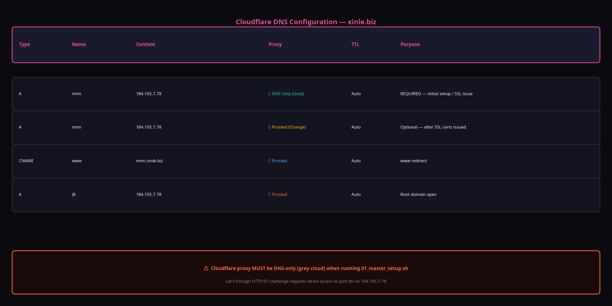

# Guide: Cloudflare DNS Setup

**Version: 6.0**

Proper DNS configuration in Cloudflare is critical for both the initial deployment and the ongoing operation of the infrastructure.

---

## Required Records

Here are the essential DNS records you need to configure for the `xinle.biz` domain.

| Type    | Name  | Content      | Proxy Status          | Purpose                                      |
| :------ | :---- | :----------- | :-------------------- | :------------------------------------------- |
| **A**   | `rmm` | `184.105.7.78` | **DNS Only (Grey)**   | **Required for initial setup.** Let's Encrypt needs this. |
| **A**   | `@`   | `184.105.7.78` | Proxied (Orange)      | Points the root domain (`xinle.biz`) to the VPS. |
| **CNAME** | `www` | `rmmx.xinle.biz`  | Proxied (Orange)      | Redirects `www.xinle.biz` to `rmmx.xinle.biz`. |

---

## The Golden Rule: DNS Only for Setup

> **WARNING:** Before you run the `01_master_setup.sh` script for the first time, the `A` record for `rmmx.xinle.biz` **must** be set to **DNS Only (Grey Cloud)**.

**Why?**

Nginx Proxy Manager uses Let's Encrypt to automatically issue a free SSL certificate for `rmmx.xinle.biz`. To do this, Let's Encrypt's servers need to connect directly to your VPS on port 80 to verify that you control the domain (this is called the HTTP-01 challenge). 

If the Cloudflare proxy is active (orange cloud), it will block this direct connection, and the SSL certificate will fail to issue.

### After Setup

Once the master script has run successfully and you can access your services via HTTPS, you can safely **enable the Cloudflare proxy (orange cloud)** for the `rmm` record. This will provide DDoS protection, caching, and hide your server's true IP address from public view.
