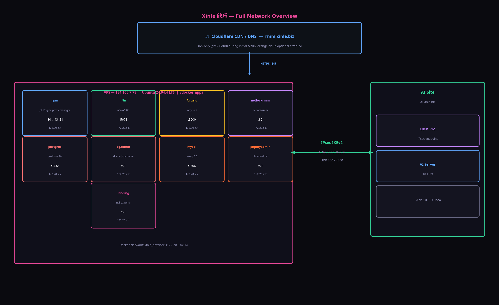
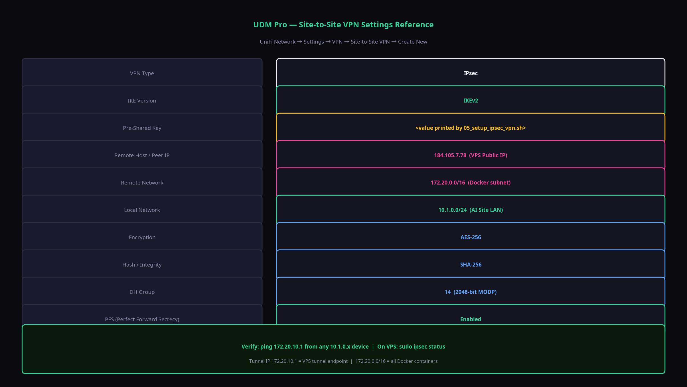
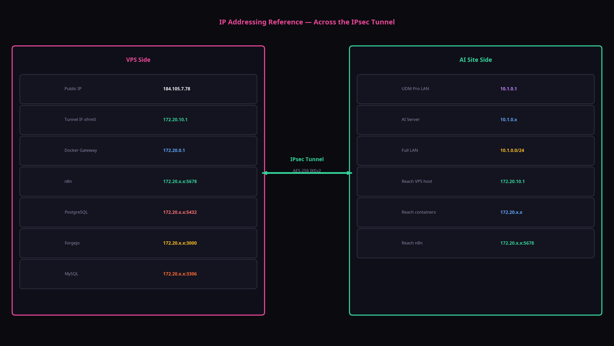

# Guide: IPsec Site-to-Site VPN Setup

**Version: 8.3**

This guide details the setup and configuration of the secure IPsec site-to-site VPN that connects the VPS to your AI site LAN (managed by a UDM Pro).

---

## 1. Architecture Overview

The VPN creates a permanent, encrypted tunnel between the two networks, allowing devices on either side to communicate as if they were on the same LAN. 

-   **VPS Side:** Uses **strongSwan**, a powerful open-source IPsec server.
-   **AI Site Side:** Uses the **native Site-to-Site VPN** feature of the UniFi Dream Machine Pro.



## 2. Automated Setup on the VPS

The `01_master_setup.sh` script automatically handles the entire VPS-side configuration by running the `05_setup_ipsec_vpn.sh` script. This script performs the following actions:

1.  Installs `strongswan`.
2.  Generates a secure, random Pre-Shared Key (PSK).
3.  Writes the `/etc/ipsec.conf` and `/etc/ipsec.secrets` configuration files.
4.  Opens UDP ports 500 and 4500 in the UFW firewall.
5.  Creates a persistent virtual tunnel interface (`xfrm0`) at `172.20.10.1`.
6.  Starts and enables the strongSwan service.

At the end of the setup, it will print the exact values you need to configure your UDM Pro.

## 3. UDM Pro Configuration

After the master script finishes, log into your UniFi Network Application and follow these steps:

1.  Navigate to **Settings > VPN > Site-to-Site VPN**.
2.  Click **Create New**.
3.  Enter the values exactly as printed by the setup script. Use the diagram below as a visual reference.



| Field                       | Value                                       |
| :-------------------------- | :------------------------------------------ |
| **VPN Type**                | IPsec                                       |
| **IKE Version**             | IKEv2                                       |
| **Pre-Shared Key**          | `<value printed by script>`                 |
| **Remote Host / Peer IP**   | `184.105.7.78`                              |
| **Remote Network**          | `172.20.0.0/16`                             |
| **Local Network**           | `10.1.0.0/24`                               |
| **Encryption**              | AES-256                                     |
| **Hash**                    | SHA-256                                     |
| **DH Group**                | 14                                          |
| **PFS**                     | Enabled                                     |

4.  Click **Save**. The tunnel should establish within a few seconds.

## 4. Verifying the Connection

You can verify the tunnel is active from both sides:

-   **From the AI Site (e.g., your workstation on 10.1.0.x):**

    ```bash
    ping 172.20.10.1
    ```
    A successful reply from the VPS tunnel interface confirms the tunnel is up.

-   **From the VPS:**

    ```bash
    sudo ipsec status
    ```
    This command will show the status of the `xinle-s2s` connection, including whether it is established.

## 5. How to Use the Tunnel: Cross-Network Access

Once established, you can access services across the tunnel using their private IPs. The key is knowing which IP to use for which resource.



### From AI Site (10.1.0.0/24) to VPS (172.20.0.0/16)

Any device on your local AI site network can reach any container on the VPS by its **Docker IP address**. You can find these IPs by running `docker network inspect xinle_network` on the VPS.

| Use Case                                | Tool on AI Site        | Destination IP Address (on VPS)                               |
| :-------------------------------------- | :--------------------- | :------------------------------------------------------------ |
| **Connect to PostgreSQL DB**            | DBeaver, pgAdmin, etc. | `172.20.x.x:5432` (PostgreSQL container IP)                   |
| **Connect to MariaDB**                  | HeidiSQL, MySQL WB     | `172.20.x.x:3306` (MariaDB container IP)                      |
| **SSH into a container**                | Terminal / SSH Client  | `ssh sar@172.20.x.x` (Requires SSH server in container)       |
| **Access a container's web UI**         | Web Browser            | `http://172.20.x.x:<port>` (e.g., a dev web server)           |
| **Ping the VPS tunnel endpoint**        | Terminal / `ping`      | `ping 172.20.10.1` (Verifies tunnel is up)                    |

**Example: Finding the PostgreSQL IP and connecting**

1.  **On the VPS:**
    ```bash
    docker inspect postgres | grep IPAddress
    # "IPAddress": "172.20.0.5"
    ```
2.  **On your AI Site workstation:**
    -   Open DBeaver.
    -   Create a new PostgreSQL connection.
    -   Host: `172.20.0.5`
    -   Port: `5432`
    -   User: `sar`
    -   Password: `tb,Xinle2026!`

### From VPS Containers to AI Site (10.1.0.0/24)

Any container on the VPS can reach any device on your local AI site network by its **standard local IP address**.

| Use Case                                      | Tool on VPS          | Destination IP Address (on AI Site) |
| :-------------------------------------------- | :------------------- | :---------------------------------- |
| **n8n calls an internal API**                 | n8n HTTP Request node| `http://10.1.0.50/api/v1/data`      |
| **Forgejo sends a webhook**                   | Forgejo Webhook      | `http://10.1.0.100:8080/webhook`    |
| **A script pings a local server**             | `ping` in a container| `ping 10.1.0.1` (e.g., the UDM Pro) |

This bidirectional access is possible because the IPsec tunnel correctly routes traffic between the `172.20.0.0/16` and `10.1.0.0/24` subnets.
